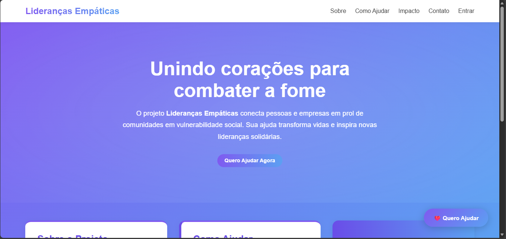

# FECAP - Fundação de Comércio Álvares Penteado

<p align="center">
<a href= "https://www.fecap.br/"></a>
</p>

# Lideranças Empaticas

## CTRL+ALT+DEL

## Integrantes: <a href="">Yuri Oliveira Santana</a>, <a href="">Mauricio Suster</a>, <a href="">Kaio Inglez</a>, <a href="">Gustavo Diniz</a></a>

## Professores Orientadores: <a href="">Kátia Milani Lara Bossi</a>, <a href="">Cristina Machado Correa Leite</a>, <a href="">Jésus Gomes</a>, <a href="">David de Oliveira Lemes</a>, <a href="">Francisco de Souza Escobar</a>

## Descrição





A proposta deste projeto interdisciplinar é desenvolver uma aplicação web responsiva que 
permita aos professores, mentores e alunos acompanharem e gerenciarem as atividades 
realizadas pelas equipes participantes. A plataforma será utilizada em edições semestrais e 
deverá contemplar o fluxo completo: desde o cadastro das equipes e atividades até a geração 
de relatórios de desempenho
<br><br>
Objetivo Geral:
Desenvolver uma aplicação web completa que permita o gerenciamento das edições do 
projeto Lideranças Empáticas, com controle de equipes, atividades, metas e resultados, 
apoiando a coordenação e promovendo transparência no acompanhamento das ações
<br><br>

## 🔗 Banco de Dados
 
* Entrega 1: A modelagem do banco de dados está documentada em: 
👉 [`/BD/README.md`](documentos/Entrega%201/BD/README.md)

* Entrega 2: A implementação está documentada em: 
👉 [`/BD/README.md`](documentos/Entrega%202/BD/README.md)


<br><br>
**Entrega 1 contempla:**

* Backend funcional com **Node.js + Express + MySQL**
* Frontend em **React** com layout responsivo (Flexbox/Grid)
* CRUD básico de usuários (Create, Read, Update, Delete)
* Integração parcial frontend ↔ backend via **Axios**

---

## 🛠 Tecnologias Utilizadas

**Frontend:** React, React Router DOM, Recharts, Framer Motion, Bootstrap, Axios, Vite
**Backend:** Node.js, Express, MySQL, MSSQL, CORS, dotenv
**DevTools:** VSCode, Postman, Netlify (frontend), Render (backend)

**Links de Deploy:**

* Backend: [https://twosemestre.onrender.com/](https://twosemestre.onrender.com/)
* Frontend: [https://warm-baklava-3e9f5f.netlify.app/](https://warm-baklava-3e9f5f.netlify.app/)

---

## 📂 Estrutura do Projeto
```
├── 📁 backend
│ ├── 📁 src
│ │ ├── 📄 app.js
│ │ ├── 📄 db.js
│ │ ├── 📄 db.test.js
│ │ ├── 📄 routes.js
│ │ └── 📄 server.js
│ ├── ⚙️ package-lock.json
│ └── ⚙️ package.json
├── 📁 frontend
│ ├── 📁 .netlify
│ │ ├── 📁 blobs-serve
│ │ ├── 📁 functions-internal
│ │ ├── 📁 v1
│ │ │ └── 📁 functions
│ │ └── ⚙️ state.json
│ ├── 📁 public
│ │ ├── 📄 _redirects
│ │ └── 🖼️ vite.svg
│ ├── 📁 src
│ │ ├── 📁 assets
│ │ │ └── 🖼️ react.svg
│ │ ├── 📁 context
│ │ │ └── 📄 AuthContext.jsx
│ │ ├── 📁 css
│ │ │ ├── 🎨 App.css
│ │ │ ├── 🎨 Doacoes.css
│ │ │ ├── 🎨 Equipes.css
│ │ │ ├── 🎨 Eventos.css
│ │ │ ├── 🎨 Home.css
│ │ │ ├── 🎨 HomePage.css
│ │ │ ├── 🎨 Login.css
│ │ │ ├── 🎨 NotFound.css
│ │ │ ├── 🎨 TopMenu.css
│ │ │ ├── 🎨 dashboard.css
│ │ │ ├── 🎨 index.css
│ │ │ └── 🎨 usuarios.css
│ │ ├── 📄 App.jsx
│ │ ├── 📄 Dashboard.jsx
│ │ ├── 📄 Doacoes.jsx
│ │ ├── 📄 Equipes.jsx
│ │ ├── 📄 Eventos.jsx
│ │ ├── 📄 HomePage.jsx
│ │ ├── 📄 Login.jsx
│ │ ├── 📄 NotFound.jsx
│ │ ├── 📄 TopMenu.jsx
│ │ ├── 📄 home.jsx
│ │ ├── 📄 main.jsx
│ │ └── 📄 usuarios.jsx
│ ├── ⚙️ .gitignore
│ ├── 📝 README.md
│ ├── 📄 eslint.config.js
│ ├── 🌐 index.html
│ ├── ⚙️ netlify.toml
│ ├── ⚙️ package-lock.json
│ ├── ⚙️ package.json
│ └── 📄 vite.config.js
├── ⚙️ .gitignore
└── 📝 README.md
```

---

> Clique nos links para acessar as pastas diretamente no repositório.

---
## 💻 Como Rodar o Projeto Localmente

### Backend

```bash
cd src/Entrega\ 1/Backend
npm install
npm run dev
```

Servidor disponível em: `http://localhost:5000/api`

> Configure o banco de dados em `db.js` antes de rodar.

### Frontend

```bash
cd src/Entrega\ 1/Frontend
npm install
npm run dev
```

Frontend disponível em: `http://localhost:5173`

---

## 🔗 Integração

* O frontend se comunica com a API usando **Axios**
* CRUD de usuários implementado e testado via Postman

---

## 🌟 Próximas Extensões (Futuras Entregas)

* Autenticação com **JWT**
* Upload de imagens (Multer)
* Dashboard com gráficos de desempenho
* Relatórios em PDF
* Sistema de notificações
* Área de comunicação mentor ↔ equipe

---
## 📝 Observações

* Código modularizado, legível e comentado
* Layout responsivo (Flexbox/Grid)
* Testado em navegadores modernos (Chrome, Edge, Firefox)
* Deploy obrigatório: Frontend (Netlify), Backend (Railway/Render)

## 🎓 Referências

Aqui estão as referências usadas no projeto.

1. <https://liderancasempaticas.com/>
